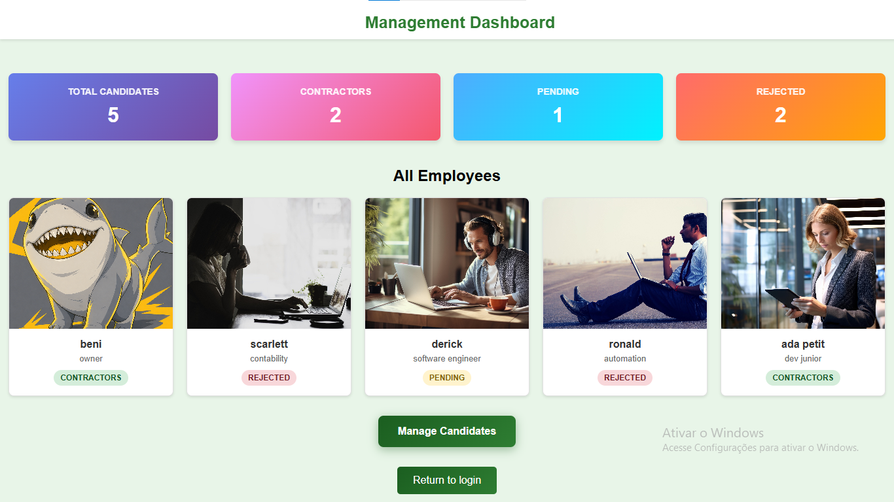
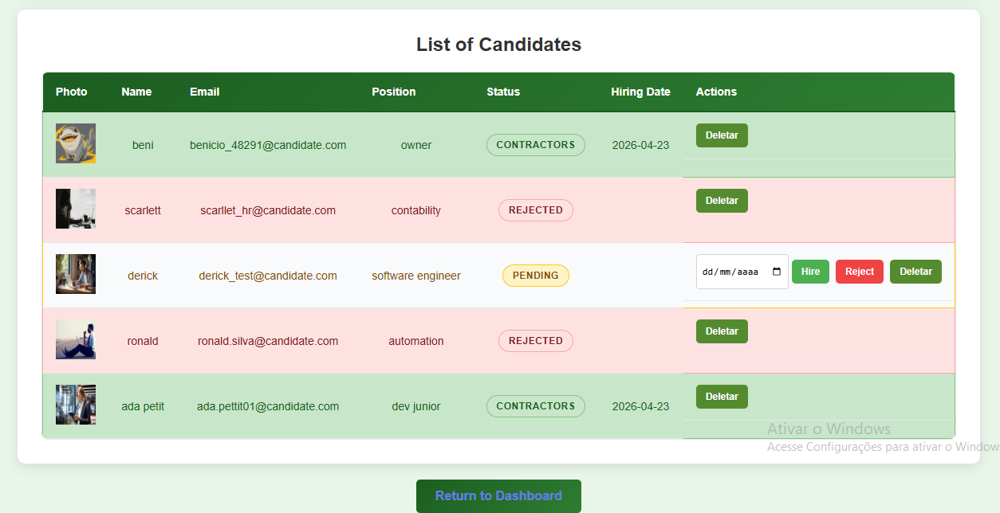
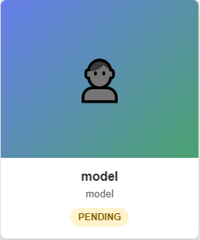
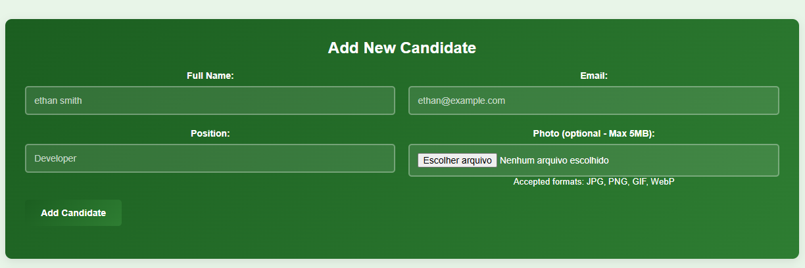

<div align="center">

# 🏢 HR Management Web
 
### A full-stack Human Resources Management System built with Go, Gin, and SQLite
 
[](https://github.com/beni-pixelado/hr-management-web)
[](https://github.com/beni-pixelado/hr-management-web)
[](https://golang.org)
[](./LICENSE)
[](https://sqlite.org)
 
<br/>
> A lightweight but production-minded HR candidate management platform that streamlines the recruitment pipeline — from candidate intake to final status resolution — with a clean dashboard and structured data model.
 
</div>
---
 
## 📋 Table of Contents
 
- [Overview](#-overview)
- [Features](#-features)
- [Tech Stack](#-tech-stack)
- [Project Structure](#-project-structure)
- [System Behavior](#-system-behavior--candidate-lifecycle)
- [Installation](#-installation)
- [Usage](#-usage)
- [Screenshots](#-screenshots)
- [Testing](#-testing)
- [Future Improvements](#-future-improvements--roadmap)
- [License](#-license)
---
 
## 🔍 Overview
 
**HR Management Web** is a self-contained Human Resources platform designed to manage candidate pipelines with clarity and efficiency. Built on top of Go with the Gin web framework, it delivers a server-rendered multi-page application that handles candidate registration, profile photo uploads, real-time status updates, and an at-a-glance dashboard — all backed by a lightweight SQLite database.
 
This project was architected with separation of concerns in mind: the backend exposes dedicated handlers for authentication and employee operations, while the frontend is a clean HTML/CSS/JS layer rendered through Gin's templating engine. The result is a maintainable, portable application that requires zero external infrastructure to run.
 
Whether deployed on a local machine or a small VPS, HR Management Web is designed to be **simple to operate and easy to extend**.
 
---
 
## ✨ Features
 
### 👤 Candidate Management
- **Add new candidates** with name, job position, and profile photo upload
- **Photo upload support** with automatic fallback to a default gray avatar when no image is provided
- **Full candidate listing** displayed in a sortable, readable table
- **Individual candidate cards** showing photo, name, position, and current status at a glance
### 📊 Status Pipeline
- **Three-state status system**: `Pending`, `Accepted`, `Rejected`
- Status can be updated at any point in the candidate lifecycle
- Status changes are reflected immediately across all views (table and cards)
### 🧭 Dashboard
- Centralized metrics panel showing total counts for:
  - ✅ Accepted candidates
  - ❌ Rejected candidates
  - ⏳ Pending candidates
- Provides HR staff with a real-time snapshot of recruitment health
### 🔐 Authentication
- User registration and login system
- Separate register and login views
---
 
## 🛠️ Tech Stack
 
### Frontend
| Technology | Purpose |
|---|---|
| **HTML5** | Semantic structure and page markup |
| **CSS3** | Responsive design, layout, and component styling |
| **JavaScript** | Client-side interactivity and dynamic UI behavior |

### Backend
| Technology | Purpose |
|---|---|
| **Go (Golang)** | Core application language — performant and statically typed |
| **Gin-gonic** | HTTP web framework for routing, middleware, and server-side rendering |
| **HTML Templates (`html/template`)** | Server-side rendering of dynamic views |
| **SQLite3** | Embedded relational database — zero-configuration, file-based |
 
### Tooling
| Tool | Purpose |
|---|---|
| **Git** | Version control and change tracking |
| **Go Build** | Compilation and binary bundling |
| **Go Testing Package** | Unit and integration test execution |
| **Makefile** | Task automation (build, test, seed, run) |
 
---
 
## 📁 Project Structure
 
```
hr-management-web/
├── LICENSE                         # Project license
├── README.md                       # This file
├── go.mod                          # Go module definition
├── go.sum                          # Dependency lock file
├── makefile                        # Build and task automation
│
├── backend/
│   ├── cmd/
│   │   ├── server/                 # Application entrypoint — starts the HTTP server
│   │   ├── seed_users/             # CLI utility to seed the database with test users
│   │   └── list_users/             # CLI utility to list all users in the database
│   │
│   ├── handlers/
│   │   ├── auth.go                 # Authentication handlers (login, register, logout)
│   │   └── employee.go             # Employee/candidate CRUD and status handlers
│   │
│   ├── templates/
│   │   ├── login.html              # Login page template
│   │   ├── register.html           # Registration page template
│   │   ├── dashboard.html          # Dashboard overview with metrics
│   │   └── employees.html          # Candidate table and card views
│   │
│   └── uploads/                    # Uploaded candidate profile photos
│
├── data/
│   └── users.db                    # SQLite database file
│
├── docs/                           # Technical documentation
│
├── frontend/
│   ├── css/                        # Global and component stylesheets
│   └── js/                         # Client-side JavaScript modules
│
└── tests/
    ├── integration/                # Integration test suites
    └── loads/                      # Load/stress test configurations
```
 
---
 
## 🔄 System Behavior — Candidate Lifecycle
 
Every candidate registered in the system follows a defined lifecycle with three possible states:
 
```
           ┌─────────────────────────────────────────┐
           │             Candidate Registered         │
           └────────────────────┬────────────────────┘
                                │
                                ▼
                        ┌───────────────┐
                        │    PENDING    │  ◄── Default state on creation
                        └───────┬───────┘
                                │
               ┌────────────────┴────────────────┐
               │                                 │
               ▼                                 ▼
       ┌───────────────┐                 ┌───────────────┐
       │   ACCEPTED    │                 │   REJECTED    │
       └───────────────┘                 └───────────────┘
```
 
- **Pending**: The default state when a candidate is first added. Indicates the review process is still in progress.
- **Accepted**: The candidate has been approved and is progressing through the hiring pipeline.
- **Rejected**: The candidate has been reviewed and will not proceed further.
Status transitions are **manually controlled**, allowing HR staff full flexibility during the evaluation process.
— HR staff can update any candidate's status at any time. The dashboard metrics update accordingly after each change.
 
---
 
## ⚙️ Installation
 
### Prerequisites
 
Make sure the following are installed on your system:
 
- [Go](https://golang.org/dl/) `>= 1.21`
- [Git](https://git-scm.com/)
- A terminal (bash, zsh, PowerShell, etc.)
> SQLite3 is used via a Go driver and runs as a local file-based database (no external setup required) — no separate installation required.
 
---
 
### 1. Clone the Repository
 
```bash
git clone https://github.com/beni-pixelado/hr-management-web.git
cd hr-management-web
```
 
### 2. Install Go Dependencies
 
```bash
go mod download
```
 
### 3. (Optional) Seed the Database
 
Populate the database with initial test users using the seed utility:
 
```bash
go run ./backend/cmd/seed_users
```
 
To verify users were created:
 
```bash
go run ./backend/cmd/list_users
```
 
### 4. Run the Server
 
```bash
make run
```
 
Or directly:
 
```bash
go run ./backend/cmd/server
```
 
The application will be available at: **`http://localhost:8080`**
 
---
 
## 🚀 Usage
 
### Starting the Application
 
```bash
make run
```
 
### Accessing the Application
 
| Route | Description |
|---|---|
| `GET /login` | Login page |
| `GET /register` | Registration page |
| `GET /dashboard` | Metrics overview (authenticated) |
| `GET /employees` | Candidate table and cards (authenticated) |
| `POST /employees` | Add a new candidate |
| `PUT /employees/:id/status` | Update candidate status |
 
### Adding a Candidate
 
1. Navigate to the **Employees** page
2. Fill in the candidate's name and job position
3. Optionally upload a profile photo (JPEG/PNG)
4. Click **Add Candidate** — the candidate is created with `Pending` status by default
### Updating Candidate Status
 
1. Locate the candidate in the table or card view
2. Select the desired status: `Accepted`, `Rejected`, or `Pending`
3. The dashboard metrics will reflect the change immediately
### Running All Available Commands via Makefile
 
```bash
make run         # Start the HTTP server
make test        # Run test suites
```
 
---
 
## 📸 Screenshots
 
> **Note:** > Screenshots are representative placeholders. Replace them with real application images from your local or deployed environment..
 
### Dashboard


 
### Candidate Table


 
### Candidate Cards


 
### Login Page

 
### Add Candidate Form


 
---
 
## 🧪 Testing
 
Integration tests validate critical application flows such as:
- Candidate creation
- Status transitions
- Authentication and session handling
 
### Running Integration Tests
 
```bash
make test
```
 
Integration tests validate the core handler behaviors — candidate creation, status transitions, and authentication flows — against a live (test) database instance.
 
---
 
## 🗺️ Future Improvements / Roadmap
 
The following improvements are planned for upcoming versions of the project:
 
### v1.1 — Quality of Life
- [ ] Search and filter candidates by name, position, or status
- [ ] Pagination for the candidates table (performance at scale)
- [ ] Inline editing for candidate name and position
- [ ] Toast notifications for status changes and form submissions
### v1.2 — Authentication Hardening
- [ ] Introduce JWT-based authentication as an alternative to session cookies
- [ ] Role-based access control (Admin, Recruiter, Viewer)
- [ ] Password hashing with bcrypt (if not already applied)
- [ ] Account management (change password, deactivate account)
### v1.3 — Enhanced Data Model
- [ ] Candidate notes/comments section
- [ ] Interview scheduling and date tracking
- [ ] Department and team assignment
- [ ] Audit trail for status change history
### v2.0 — Architecture Evolution
- [ ] REST API backend with full OpenAPI/Swagger documentation
- [ ] React or HTMX-powered frontend for richer UX
- [ ] PostgreSQL support as an alternative to SQLite for production deployments
- [ ] Docker and Docker Compose setup for containerized deployment
- [ ] CI/CD pipeline via GitHub Actions
---
 
## 📄 License
 
This project is licensed under the **MIT License**. See the [LICENSE](./LICENSE) file for full details.
 
---
 
<div align="center">
Built with ❤️ using Go + Gin | Designed for portfolio and production alike (take a star⭐ to i buy a food :D thanks)
 
</div>